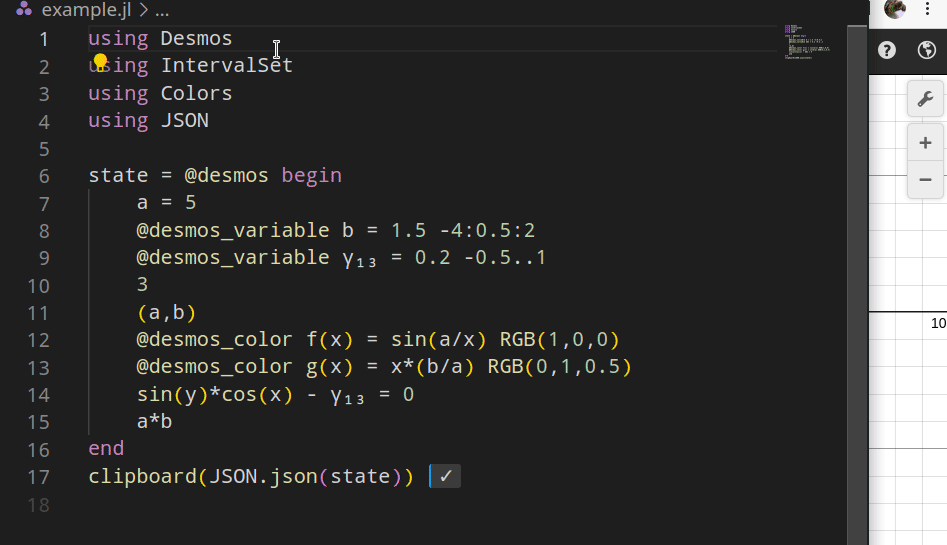

# Desmos.jl
Generate Desmos script (JSON) with Julia language.

# Example
```julia
using Desmos
using IntervalSet
using Colors
using JSON

state = @desmos begin
    a = 5
    @desmos_variable b = 1.5 -4:0.5:2
    @desmos_variable γ₁₃ = 0.2 -0.5..1
    3
    (a,b)
    @desmos_color f(x) = sin(a/x) RGB(1,0,0)
    @desmos_color g(x) = x*(b/a) RGB(0,1,0.5)
    sin(y)*cos(x) - γ₁₃ = 0
    a*b
end
clipboard(JSON.json(state))
```


Note that this requires [DesmosTextIO chrome extension](https://chrome.google.com/webstore/detail/desmos-text-io/ndjdcebpigpfidnilppdpcdkibidfmaa).

# TODO
* [ ] Support DataFrames.jl
* [ ] Support images
* [ ] Support parametri curves
